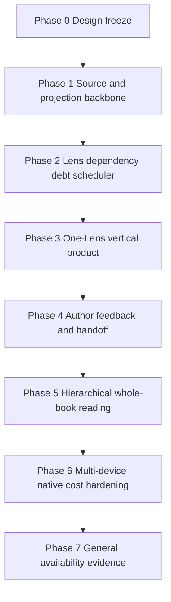

# Shadow Ambient Editor delivery and acceptance

Status: **normative delivery plan; implementation not started**

Updated: 2026-08-11

This plan turns the target architecture into independently verifiable product
increments. A phase is complete only when implementation, deterministic tests,
documentation, capability/status reporting, and remaining manual boundaries
land together.

No phase may claim the final product from schema presence, model output, a
successful build, or a screenshot alone.

## 1. Delivery rules

1. Work proceeds on the shared Agent Runtime; no standalone Shadow runtime is
   introduced as a shortcut.
2. Projection correctness lands before editorial model output.
3. Concern identity/lifecycle lands before author-facing notifications.
4. One narrow, evidence-heavy Lens proves the complete vertical path before
   generalized whole-book literary analysis.
5. Synced author-visible objects require Core/Server schema and outbox parity in
   the same milestone.
6. Every provider path has deterministic schema/tool conformance before a paid
   canary.
7. Real-provider and real-author evidence supplement deterministic gates; they
   never replace them.
8. Physical-device, sleep/resume, performance, and visual acceptance remain
   explicit when automation cannot prove them.
9. The retired Shadow acceptance remains active throughout all phases.
10. A phase disabled behind an internal flag is not a shipped capability unless
    current status and capability inventory say otherwise.

## 2. Progressive module graph



Each arrow is a release gate, not a suggested coding order. Parallel internal
work is allowed, but later-phase behavior cannot be author-visible until its
dependencies pass.

## 3. Phase 0 — design freeze

### Scope

- Freeze product vision, authority model, module boundaries, schema direction,
  progressive delivery, and acceptance policy.
- Add durable repository navigation and current-status disclosure.
- Add a machine check that distinguishes frozen design from implementation.

### Exit evidence

- `docs/ambient-editor/README.md`
- `docs/ambient-editor/product-vision.md`
- `docs/ambient-editor/technical-architecture.md`
- this delivery/acceptance document
- README/docs/current-status links
- `ambient-editor-design.acceptance.test.ts`
- retired Shadow boundary test still passes

### Shipped behavior

None. Phase 0 authorizes implementation but does not create an Ambient product,
provider route, database table, settings entry, or UI.

## 4. Phase 1 — source and projection backbone

### Modules

- M0 Source Head Scanner
- M1 Semantic Projector
- local projection repositories
- deterministic evidence/anchor validation
- projection diagnostics without author-facing Concerns

### First supported projection

Start with one high-precision Claim family: explicit character knowledge state
derived from live Yjs and relevant Canon/patch sources. Implement the generic
source/fingerprint protocol, but avoid broad Claim extraction until the narrow
path proves freshness and evidence behavior.

### Required behavior

- Discover mounted-editor, closed-chapter, sync-pulled, and restart-time source
  changes through fingerprints.
- Never use `contentJson` as freshness authority.
- Recheck source after extraction and reject stale candidates.
- Atomically commit projection plus generated delta.
- Rebuild all local projection state from authored sources.
- Support extractor schema/version migration by invalidating affected sources.

### Exit gates

- Unit tests for canonical hashes, keys, Claim schemas, and interval identity.
- Integration tests for Yjs revision/provenance and Canon/patch fingerprints.
- Fault injection before/after lease, extraction, recheck, and transaction.
- A one-block edit rebuilds only the affected leaf and declared ancestors.
- Repeating the same scan/projection produces no new delta.
- Invalid/ambiguous evidence cannot commit.
- Full local projection deletion followed by rebuild produces equivalent stable
  content hashes.
- No provider write tool or author-facing UI exists.

### Explicitly unverified

- Literary usefulness.
- Provider extraction quality beyond deterministic fixtures.
- Whole-book scaling.

## 5. Phase 2 — Lens, dependency, Debt, and scheduler

### Modules

- M2 Lens Registry and Compiler
- M3 Dependency Invalidator
- M4 Review Debt Queue
- M5 Ambient Scheduler admission without editorial provider output
- local budget ledger and lifecycle reason codes

### Required behavior

- Store immutable author Lens text and compiled plan revisions.
- Reject invalid, unbounded, mutating, or hidden-provider plans.
- Convert relevant Semantic Deltas into bounded Lens/scope debt.
- Coalesce repeated inputs and increment generation.
- Exercise lease expiry, retry, budget block, suspend/resume, user activity, and
  project switch with an injectable clock.
- Expose a developer-only debt inspector, not a user Concern Inbox.

### Exit gates

- Relevant change creates one coalesced debt item.
- Irrelevant change creates zero debt for the Lens.
- New input during a lease invalidates the older generation.
- Restart converts expired running/leased work to a legal pending/retry state.
- Active-user, explicit Agent activity, exhausted budget, unavailable provider,
  suspend, and project switch all prevent admission with exact reason codes.
- No fallback provider is selected.
- Lens coverage summary accurately reflects the compiled plan.
- Disabling/changing a Lens prevents stale-generation admission.

### Explicitly unverified

- Concern quality and UI.
- Paid provider behavior.

## 6. Phase 3 — one-Lens vertical product

This is the first author-visible milestone.

### Narrow product slice

Ship one Lens family: explicit character knowledge boundary against manuscript
evidence and effective Canon. It is selected because its subjects, temporal
scope, evidence, and contradiction/ambiguity modes can be tested more precisely
than pacing or style.

### Modules

- M6 Context Assembler
- M7 Ambient Runtime Profile
- M8 Deterministic Reconciler
- M9 Concern Domain
- initial M10 Concern Inbox
- M11 Core/Server sync for Lens/Concern/decision/evidence
- M12 run receipt and budget diagnostics

### Required behavior

- Dedicated generated read-only Ambient tool manifest.
- Structured `submit_reconciliation` completion only.
- Source/Lens/debt generation validation before commit.
- Stable `issueKey`, `eligibilityFingerprint`, `basisHash`, and deterministic
  Concern ID.
- Append-only Concern revisions/evidence/dependencies and author decisions.
- Inbox supports New, Updated, Reconsidered, Resolved, evidence navigation,
  “Why now,” seen, and exact-basis dismiss.
- Synced objects have Core/Server schema/API/outbox parity.
- World Model, debt, and run details remain local.

### Deterministic exit gates

- Ambient tool allowlist contains only declared reads and terminal submission.
- Projection mode accepts only frozen-source reads and
  `submit_projection_candidate`; reconciliation mode cannot use that terminal.
- Ambient tool denylist proves zero General Agent write, MCP, Web, shell,
  filesystem, or durable-grant exposure.
- Normal assistant text cannot complete a run.
- Wrong-project, stale-source, stale-Lens, stale-generation, bad-anchor, missing
  entity, or out-of-scope proposal commits zero Concerns.
- Same proposal/basis repeated locally produces one Concern/revision.
- Crash after Concern commit but before UI projection produces no duplicate run
  effect.
- Exact dismissal plus unchanged basis resurfaces zero times.
- Relevant basis change reconsiders the same Concern exactly once.
- Irrelevant source change does not reconsider it.
- Evidence deletion can resolve while preserving history.
- A stochastic clean run against unchanged basis cannot auto-resolve an active
  Concern.
- Device-equivalent `basisHash` fixtures produce the same deterministic ID.
- Synced machine refresh never overwrites author disposition.
- Comment/TODO and Agent Memory are not Concern truth stores.

### Live-provider exit gates

For every provider route claimed by capability inventory:

- frozen-source projection -> structured candidate canary;
- successful read -> structured completion canary;
- no-concern canary;
- invalid evidence/schema canary proving local rejection;
- cancellation and source-change canary;
- usage receipt and hard budget enforcement;
- prompt/tool capture proving no write or hidden external surface.

Credentials and manuscript text must not appear in checked-in artifacts.

### Author/manual exit gates

- At least two real projects and multiple book lengths.
- Authors can explain why each sampled Concern appeared.
- Inbox is visually reviewed for progressive disclosure, anchors, grouping,
  notification quietness, and absence of pass/fail cues.
- Native desktop idle/resume/project-switch behavior is exercised.
- Current status distinguishes deterministic, paid-provider, real-project, and
  manual visual evidence.

## 7. Phase 4 — author feedback and action handoff

### Modules and features

- exact dismissal history hardening;
- proposed and author-confirmed Editorial Precedents;
- TODO conversion with explicit `originConcernId`;
- concise open-Concern projection for Copilot;
- explicit General Agent task handoff;
- author-visible Precedent scope, revision, disable, and delete behavior.

### Exit gates

- Dismiss reason alone never creates a generalized policy.
- Confirming a Precedent states its Lens/scope in plain language and records an
  immutable revision.
- Active Precedent versions participate in eligibility fingerprints.
- Editing/disabling a Precedent invalidates only dependent work.
- Every Concern affected by a Precedent can disclose which revision was used.
- TODO creation is idempotent and leaves Concern lifecycle independent.
- Copilot disabled/closed editor causes no projection gap.
- Copilot suggestions never directly resolve Concerns.
- General Agent receives normal explicit authorization; Ambient runtime grants
  do not transfer.
- General Agent changes resolve Concerns only after normal source projection and
  reconciliation.

## 8. Phase 5 — hierarchical whole-book reading

### Scope

- complete block-section -> chapter -> act/storyline -> book Span Digest tree;
- deep-idle map/reduce reconciliation;
- additional Lens families introduced one at a time:
  - relationship/character arc;
  - setup and payoff;
  - repetition;
  - pacing and emotional beat distribution;
  - timeline and location continuity.

### Release policy per Lens family

Each Lens family needs its own:

- typed inputs and dependency rules;
- bounded scope policy;
- evidence minimum;
- deterministic fixtures and adversarial false-positive cases;
- paid-provider canary;
- real-author qualitative evaluation;
- cost/latency envelope;
- explicit unsupported interpretations.

No generic “literary review” Lens may bypass this family-by-family process.

### Exit gates

- One leaf edit invalidates only declared ancestors and dependent Concerns.
- Parent digest hashes are deterministic for identical child manifests.
- Final Concerns cite raw prose/Canon evidence, never generated digests alone.
- Whole-book context does not naïvely concatenate all prose.
- Map retries and reduce retries are independently idempotent.
- Deep work never starts inside active/warm windows.
- Representative small/medium/large projects remain within recorded token,
  wall-time, memory, and output-count budgets.
- Output count limits do not convert hidden findings into a quality score.

## 9. Phase 6 — multi-device, native, and cost hardening

### Scope

- concurrent device convergence;
- offline edits and later sync;
- author-decision precedence under conflict;
- renderer/native suspend and resume fault campaigns;
- provider outage/rate-limit/key removal;
- projection retention and compaction;
- long-running budget, memory, database, and battery behavior;
- notification digest tuning.

### Exit gates

- Same issue/basis from two devices converges to one Concern.
- Equivalent proposals with different generated wording converge through the
  same Lens-specific typed identity encoder.
- Different valid bases preserve ordered revisions and author decisions.
- Offline dismissal cannot be overwritten by machine refresh after sync.
- Projection database can be compacted/deleted and rebuilt without changing
  synced Concern identity.
- Suspend/project switch/app close at every fault point leaves legal debt/run
  state and no cross-project commit.
- Four-hour and twelve-hour workload-equivalent automated runs meet declared
  database growth, memory, retry, and budget ceilings.
- Physical desktop/iOS/Android checks cover activity detection, touch, IME,
  safe area, background/resume, notification behavior, and visual hierarchy.
- Build/simulator evidence remains clearly separated from real-device evidence.

App-exit provider continuation is still not a release goal. If future product
requirements introduce server or OS background execution, it is a new
architecture milestone requiring separate privacy, credential, cost, and
lifecycle review.

## 10. Phase 7 — general availability evidence

### Required evidence bundle

- generated capability inventory including Ambient product profile and exact
  tool exposure;
- schema and migration inventory for Core and Server;
- deterministic acceptance report for authority, freshness, idempotence,
  lifecycle, sync, permissions, and budgets;
- provider-specific live conformance reports;
- representative real-project performance report;
- author qualitative study summary with methodology and limitations;
- native/manual checklist with unresolved boundaries;
- current status, roadmap, README, operator/debug procedure, and rollback plan.

### GA invariants

- evidence citation validity: 100% in deterministic fixtures;
- stale proposal commits: 0;
- duplicate Concern for same issue/basis: 0;
- unchanged-basis dismissal recurrence: 0;
- unauthorized write/MCP/Web tool exposure: 0;
- provider calls during configured active window: 0;
- calls beyond hard daily budget: 0;
- cross-project reads/commits: 0;
- silent provider fallback: 0.

Real-author usefulness and dismissal rates are diagnostic product metrics, not
gates that encourage Shadow to manufacture observations. A quiet useful system
may have fewer Concerns.

## 11. Acceptance matrix

| Boundary | Static | Deterministic runtime | Live provider | Manual/real project |
| --- | --- | --- | --- | --- |
| Prose/Canon authority | Import and tool deny scans | Yjs/CAS/stale-source tests | Prompt/tool capture | Author verifies no mutation |
| Projection | Schema/type checks | rebuild, idempotence, fault injection | extraction conformance | Large manuscript spot checks |
| Lens | Compiler schema | invalid/scope/version tests | plan adherence | Coverage summary comprehension |
| Debt/scheduler | State transition checks | fake clock, lease, lifecycle, budget | cancellation/rate limit | Idle/resume observation |
| Runtime profile | Generated allow/deny inventory | structured completion only | provider canaries | Models & API route behavior |
| Concern | Schema/identity checks | lifecycle/dismiss/dedupe/crash tests | proposal diversity | Editorial usefulness |
| Sync | Core/Server parity scan | conflict/offline fixtures | Not required | Multi-device checks |
| UI | component/anchor boundaries | state projection tests | Not required | Visual, navigation, notification |
| Performance | budget constants/contracts | workload-equivalent soak | paid cost sample | Real-project responsiveness |
| Privacy | surface and telemetry scan | redaction/export tests | request capture | User disclosure review |

## 12. Rollout and rollback

Implementation uses independent internal gates for projection, reconciliation,
and author-facing surfaces. Names are illustrative until implementation
discovers the existing flag pattern:

```text
ambientProjection
ambientReconciliation
ambientInbox
```

Rules:

- Projection may run before Inbox because it is local/rebuildable and has its
  own performance controls.
- Reconciliation cannot run without current projection, valid Lens, debt,
  budget, and read-only capability evidence.
- Inbox cannot surface machine Concerns until identity, lifecycle, evidence,
  and sync gates pass.
- Disabling reconciliation preserves authored Lenses, Concerns, decisions, and
  Precedents; it may delete rebuildable debt/projection by explicit maintenance
  policy.
- Rollback never converts Concern state into Comment metadata or restores old
  Shadow tables/statuses.
- A migration rollback that risks authored decisions is not automatic; forward
  repair is preferred.

## 13. Documentation updates required per phase

Every completed implementation phase updates in the same change:

- `docs/ambient-editor/*` affected contracts;
- `docs/agent-runtime/acceptance/CURRENT_STATUS.md`;
- `docs/agent-runtime/ROADMAP.md`;
- `docs/README.md` and product README if navigation changes;
- generated Agent capability inventory;
- machine acceptance output or test command;
- Core/Server migration and sync documentation when applicable;
- explicit paid-provider/native/author evidence boundaries.

Historical reports may demonstrate one checkout, but current behavior is never
derived from an old run report.

## 14. Phase completion checklist

Before marking any phase complete, answer all of the following:

- What authored or derived object became first class?
- Which component owns its truth?
- What source revision/fingerprint guards it?
- What can the provider read and write?
- What happens on duplicate execution?
- What happens if the source changes mid-run?
- What survives restart, suspend, app exit, and sync?
- Which author decision has precedence over machine refresh?
- What is rebuilt versus synced?
- What deterministic command proves the boundary?
- What paid-provider, native, visual, performance, or qualitative behavior is
  still unverified?

If any answer is implicit, the phase remains open.
