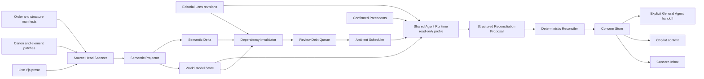

# Shadow Ambient Editor technical architecture

Status: **normative target architecture; not implemented**

Updated: 2026-08-11

## 1. Decision summary

Shadow Ambient Editor is a project-scoped, asynchronous editorial subsystem
composed on Drifting's existing renderer-owned Agent Runtime. It consumes:

1. author-owned Editorial Lenses;
2. authored Canon and in-effect `element_patch` evolution;
3. a versioned semantic projection of live Yjs prose;
4. author-confirmed editorial Precedents.

It produces stable, evidence-backed Concerns through a read-only provider
profile and a deterministic local reconciler.

Shadow is not a second Agent loop. General Agent remains the only interactive
execution product. Shadow reuses the same provider drivers, BYOK secure-storage
boundary, context planner, cancellation, scheduler primitives, and journal
conventions, while exposing a smaller read-only tool profile and a different
product lifecycle.

The retired Shadow CI architecture remains retired. This design does not
restore `src/renderer/lib/shadow`, `shadow_job`, `project_rule`, chapter review
states, `submit_verdicts`, force-pass, review gates, or the old Shadow Panel.

## 2. Non-negotiable invariants

### 2.1 Authority

1. **Live Yjs owns prose.** `node_content.contentJson` is a seed/cache and cannot
   be used as the freshness authority.
2. **The author owns Canon.** Element fields, project facts, relationships, and
   in-effect `element_patch` records define authored truth.
3. **World Model is derived.** Every unit is rebuildable, versioned, and linked
   to exact evidence. It cannot update Canon or become an implicit source of
   authored truth.
4. **Lens and Precedent are authored policy.** Machine compilation may constrain
   execution but cannot silently broaden or rewrite the author's intent.
5. **Concern is editorial state.** It is not an error, verdict, chapter status,
   or Comment projection.

### 2.2 Mutation and permission

1. Provider output never writes SQLite or Yjs directly.
2. Ambient runs receive no prose, Canon, Comment, TODO, relation, memory, MCP,
   Web, filesystem, shell, or generic object write action.
3. Only the deterministic reconciler may mutate Ambient run results and
   Concerns.
4. Author-visible General Agent work starts only after an explicit user action
   in a normal General Agent authorization boundary.
5. Cross-project reads or commits fail closed.

### 2.3 Freshness and durability

1. Events may wake the pipeline, but source fingerprints determine truth.
2. Every projection and reconciliation is guarded by a source manifest and
   generation check.
3. Work is at-least-once and result commits are idempotent.
4. No network or provider call occurs inside a database write transaction.
5. App exit, renderer loss, suspend, cancellation, or project switching may
   abandon an in-flight provider call; durable debt remains eligible for a new
   run.

### 2.4 Product behavior

1. Shadow never emits pass/fail, severity gates, force-pass, scores, or
   completion certification.
2. Shadow never interrupts active typing to surface ordinary Concerns.
3. No evidence-backed Concern means no output, not a forced observation.
4. Exact author dismissal suppresses an unchanged evaluation basis.
5. Generalized feedback becomes active only after explicit author confirmation.

## 3. System context



The pipeline deliberately separates semantic extraction from editorial
reconciliation. Extraction asks “what does the manuscript currently say?” A
Lens asks “given the author's reading intention, what deserves attention?”
Combining both in one prompt would make invalidation, evidence freshness,
deduplication, and author feedback impossible to reason about.

## 4. Module map

| Module | Owns | Reads | Writes | Must not own |
| --- | --- | --- | --- | --- |
| M0 Source Head Scanner | Current fingerprints and dirty-source discovery | Yjs revision/provenance, source rows, structure order | Projection source heads | Semantic interpretation |
| M1 Semantic Projector | Typed Claims, evidence, span digests, semantic deltas, validated extraction candidates | Stable source snapshot | Local rebuildable World Model | Canon, Concerns, direct provider writes |
| M2 Lens Registry and Compiler | Immutable Lens revisions and validated execution plans | Author Lens text, supported claim schema | Synced Lens records and compiled plan | Provider execution, hidden preference inference |
| M3 Dependency Invalidator | Mapping relevant deltas to Lens/scope work | Lens plan, delta, World Model dependency indexes | Review Debt inputs | Declaring a problem |
| M4 Review Debt Queue | Coalescing, generation, lease, retry state | Invalidation requests | Local durable debt | Editorial output |
| M5 Ambient Scheduler | Activity, lifecycle, priority, concurrency, and budget admission | Debt, app state, project state, budget ledger | Lease/run state | Long-lived provider state after process loss |
| M6 Context Assembler | Bounded, source-hashed read package | World Model, raw prose, Canon, Concern history, Precedents | Consulted-source manifest | Mutation authority |
| M7 Ambient Runtime Profile | Read-only tool loop and structured completion | Context and whitelisted reads | Proposal artifact and usage receipt | General Agent writes, MCP, Web |
| M8 Deterministic Reconciler | Proposal validation, identity, lifecycle, stale rejection | Proposal, current sources, current Lens/debt generation | Concerns and run disposition | Literary inference beyond proposal validation |
| M9 Concern Domain | Stable Concern history, evidence, author disposition | Reconciled results and author decisions | Synced Concern objects | Comment/TODO authority |
| M10 Experience Surfaces | Inbox, digest, evidence navigation, status, handoff | Concern and debt projections | Explicit author actions | Automatic manuscript changes |
| M11 Sync and Conflict Adapter | Stable cross-device IDs and author-decision precedence | Synced Ambient domain objects | Core/Server outbox and pull state | Syncing rebuildable World Model/debt |
| M12 Observability and Budget | Usage, timings, reason codes, privacy-safe diagnostics | All run receipts | Local diagnostic aggregates | Raw manuscript telemetry by default |

Dependencies flow from lower-numbered source/projection modules toward
reconciliation and experience. UI modules cannot bypass M8/M9 to create or
resolve Concerns, and provider tools cannot call M9 directly.

## 5. Source tracking and projection protocol

### 5.1 Source identities

Every semantic input has a stable `sourceKey`:

| Source kind | Example source key | Fingerprint basis |
| --- | --- | --- |
| Yjs prose | `node-content:<chapterId>` | `docId + monotonicRevision + stateHash` |
| Element Canon | `element:<elementId>` | Canonical hash of explicit semantic fields plus effective patches |
| Project facts | `project-facts:<projectId>` | Ordered canonical fact-set hash |
| Relations | `relations:<projectId>` | Ordered endpoint/kind/content hash |
| Structure | `narrative-order:<projectId>` | Chapter/act/storyline membership and order manifest hash |
| Lens | `editorial-lens:<lensId>` | Immutable Lens revision hash |
| Precedent set | `editorial-precedents:<lensId>` | Ordered active Precedent revision hash |

Local Yjs revision numbers are freshness cursors, not portable content
identities. Cross-device `basisHash` values use stable content hashes and stable
entity IDs.

### 5.2 Source head record

`ambient_projection_source` stores:

```ts
interface AmbientProjectionSource {
  projectId: string;
  sourceKey: string;
  sourceKind: AmbientSourceKind;
  observedFingerprint: string;
  projectedFingerprint: string | null;
  extractorVersion: number;
  projectionState: "dirty" | "leased" | "current" | "failed";
  leaseOwner: string | null;
  leaseExpiresAt: string | null;
  lastProjectedAt: string | null;
  lastFailureCode: string | null;
}
```

Rows are unique on `(projectId, sourceKey)`. A scanner update never claims that
semantic projection completed.

### 5.3 Discovery

Yjs persistence, authored transaction completion, future SyncEngine remote
apply, Lens changes, and app resume may all request a scan. These events are
optimization hints. Startup and periodic reconciliation compare actual source
heads so a missed event cannot leave a source permanently clean.

React editor lifecycle and Copilot debounce are not authoritative triggers
because they only observe currently mounted editors.

### 5.4 Stable projection transaction

For each dirty source:

1. wait until the configured source-settle interval has passed;
2. transactionally acquire a bounded lease for the observed fingerprint;
3. read a consistent source snapshot and construct its source manifest;
4. run deterministic parsing and, where required, bounded semantic extraction;
5. validate every evidence span against the captured snapshot;
6. reread the live source fingerprint;
7. if it changed, discard the candidate and mark the source dirty;
8. if unchanged, atomically replace affected projection rows, persist Semantic
   Delta, enqueue invalidation inputs, and advance `projectedFingerprint`;
9. release the lease and emit an out-of-transaction wake hint.

Only step 8 is a write transaction. Provider calls, tokenization, parsing, and
hashing happen outside it. The commit includes a compare-and-swap condition on
the observed fingerprint and extractor version.

On startup, expired leases become dirty. A process crash before step 8 leaves
no new projection. A crash after step 8 leaves an idempotently committed
projection and debt input.

### 5.5 Deterministic and model-assisted extraction

M1 is the only owner of World Model commits. Extraction strategies are
pluggable behind one typed candidate boundary:

- deterministic parsers may emit candidates directly;
- existing block hashes/summaries may accelerate retrieval but are not
  authority;
- model-assisted extraction runs through the shared Ambient Runtime in
  `projection` mode and may only read the frozen source package plus terminate
  with `submit_projection_candidate`.

A model-assisted candidate still passes local schema, entity, interval,
evidence, quote, source-manifest, and extractor-version validation. The model
cannot call projection repositories or advance a source cursor. This preserves
the same transaction protocol regardless of extraction strategy and prevents a
second hidden provider loop inside the Projector.

## 6. World Model

### 6.1 Narrative Claims

World Model facts use a versioned discriminated union, not a generic JSON fact
bag:

```ts
type NarrativeClaim =
  | EventClaim
  | CharacterStateClaim
  | KnowledgeClaim
  | RelationshipClaim
  | LocationClaim
  | PossessionClaim
  | SetupClaim
  | PayoffClaim
  | TimelineClaim;

interface NarrativeClaimBase {
  claimId: string;
  projectId: string;
  claimKind: NarrativeClaimKind;
  propositionKey: string;
  claimInstanceKey: string;
  subjectRef: TypedEntityRef;
  objectRef: TypedEntityRef | null;
  temporalScope: NarrativeInterval | null;
  certainty: "explicit" | "implied" | "hypothesis";
  confidence: number;
  sourceManifestHash: string;
  extractorVersion: number;
}
```

The common fields are explicit SQL columns. Kind-specific payloads use
schema-versioned typed records only where the union genuinely differs; they do
not hide first-class domain concepts in `metadataJson`.

`propositionKey` excludes evidence and temporal placement and identifies the
semantic proposition. `claimInstanceKey` adds the interval and evidence basis.
This lets a time shift become `changed` rather than unrelated `removed` and
`added` claims.

Narrative position stores stable chapter/block anchors plus the order-manifest
hash. Floating `bookOrder` values may aid sorting but cannot be the sole
temporal identity.

### 6.2 Evidence

`ambient_claim_evidence` contains one row per evidence span:

- source key and source content hash;
- chapter and block identifiers;
- `textAnchor` snapshot and exact quote hash;
- optional entity/Canon source reference;
- evidence role: `supports`, `qualifies`, or `contradicts`;
- extractor version.

Evidence quote text may be cached locally for inspection, but validity is
defined by matching the captured source version and anchor. Provider-returned
quotes are resolved against source text; unresolved or ambiguous quotes are
rejected.

### 6.3 Certainty policy

- `explicit` claims may drive narrow dependency invalidation.
- `implied` claims may contribute to contextual and deep reconciliation but do
  not independently invalidate distant scopes in the first release.
- `hypothesis` claims are ephemeral candidates unless corroborated; they cannot
  become stable World Model dependencies by themselves.

This prevents one speculative extraction from producing project-wide review
storms.

### 6.4 Narrative Span Digests

`ambient_span_digest` forms a source-hashed hierarchy:

```text
block section -> chapter -> act/storyline -> book
```

Each digest records its stable scope key, child manifest, relevant Claim IDs,
evidence refs, source manifest hash, generation strategy, and extractor version.
Parent digests are invalid when any child manifest changes.

Block-section hashes and rolling summaries already present in Drifting may be
used as caches. They do not replace a live-Yjs source read or the projection
fingerprint protocol.

Deep reconciliation uses map/reduce across digests and retrieves raw evidence
for final Concerns. A final Concern may not cite only a generated digest.

### 6.5 Semantic Delta

`ambient_semantic_delta` records stable changes between valid projections:

- claim added, removed, changed, or temporally moved;
- evidence strengthened, weakened, relocated, or invalidated;
- span digest changed;
- structure/order changed;
- Canon or effective patch changed.

Delta rows are immutable operational facts linked to before/after manifests.
They expire only after every dependent Review Debt input has been durably
recorded or the projection can deterministically regenerate them.

## 7. Editorial Lens

### 7.1 Author and compiled forms

`editorial_lens` owns identity, author-visible name, enabled state, and current
revision pointer. `editorial_lens_revision` is immutable and stores:

```ts
interface EditorialLensRevision {
  lensId: string;
  revision: number;
  authorText: string;
  planSchemaVersion: number;
  compiledPlan: LensPlanV1 | null;
  compileStatus: "valid" | "invalid";
  compileDiagnostics: LensDiagnostic[];
  createdAt: string;
}
```

`LensPlanV1` explicitly defines:

- `strategy`: `state_reconciliation`, `span_synthesis`, or
  `global_reconciliation`;
- subscribed Claim kinds, entity kinds, Canon fields, and delta kinds;
- narrative/book-order scope expansion rules;
- raw-prose and digest retrieval policy;
- `scheduleClass`: `warm` or `deep`;
- maximum scope, context class, run class, and output count;
- evidence minimum and uncertainty wording policy;
- author-visible permission and coverage summary.

Author text is immutable history. Compilation can only operationalize it. An
invalid plan disables execution for that revision and reports diagnostics; it
does not fall back to a generic review prompt.

### 7.2 Lens safety and scope

The compiler rejects plans that:

- request mutation or autonomous action;
- imply pass/fail or hidden scoring;
- cannot describe a bounded retrieval scope;
- require unavailable private/external sources;
- cannot state an evidence policy;
- silently enable Web, MCP, or a different provider.

The author approves a natural-language coverage summary. Raw plan JSON is
available only in diagnostics.

## 8. Dependency invalidation and Review Debt

### 8.1 Invalidation

The invalidator maps a Semantic Delta to zero or more `(lensRevision,
scopeKey)` pairs using the compiled Lens subscriptions and World Model indexes.
It answers “what is now eligible to be reconsidered?”, never “what is wrong?”.

Scope expansion is deterministic and capped. A local explicit knowledge change
may select the changed chapter, the nearest prior scene involving the same
character, and existing Concerns that depend on the changed Claim. A global
pacing Lens may invalidate an ancestor span digest but remains a deep-class
debt rather than launching immediately.

### 8.2 Debt schema and coalescing

`ambient_review_debt` is unique on `(projectId, lensRevisionId, scopeKey)` and
contains:

```ts
interface AmbientReviewDebt {
  debtId: string;
  projectId: string;
  lensRevisionId: string;
  scopeKey: string;
  generation: number;
  scheduleClass: "warm" | "deep";
  state: "pending" | "leased" | "running" | "retry" | "blocked";
  nextEligibleAt: string;
  attemptCount: number;
  leaseOwner: string | null;
  leaseExpiresAt: string | null;
  blockedReason: AmbientBlockedReason | null;
}
```

`ambient_review_debt_input` stores individual delta/source dependencies as
rows. A new input increments the debt generation and coalesces work; it does
not create a provider job per keystroke.

If generation changes during a run, its proposal is stale and cannot commit.
On startup, expired `leased`/`running` rows return to `pending` or `retry` with a
durable reason code.

## 9. Scheduler and lifecycle

### 9.1 Admission inputs

The scheduler considers independently:

- source quiescence;
- last author interaction;
- active editor composition/IME state;
- current project and project switching;
- explicit General Agent activity;
- warm/deep schedule class;
- network and selected-provider availability;
- configured daily token, run, output, and wall-time budgets;
- app suspend/resume and renderer shutdown signals;
- retry backoff and debt age.

### 9.2 Initial tunable defaults

These are product defaults, not semantic invariants:

- source settle: 20 seconds without a new fingerprint;
- active window: less than 45 seconds since author input, no Ambient provider
  calls;
- warm idle: at least 5 minutes;
- deep idle: at least 30 minutes or an author-configured deep window;
- maximum concurrent semantic extractor calls: 1;
- maximum concurrent warm read-only reconciliations: 2;
- maximum concurrent deep reconciliations: 1.

General Agent and direct author work have priority. Ambient runs yield or
cancel at model/tool boundaries when interactive work needs the shared
runtime. No long provider call holds the scheduler's database writer barrier.

### 9.3 Budget and fallback

Budgets are hard admission limits. When exhausted, debt moves to `blocked` with
an inspectable reason and next eligibility. Shadow does not:

- silently choose a cheaper/different provider;
- send work server-side because local BYOK is unavailable;
- reduce evidence requirements to fit budget;
- mark work complete without reconciliation.

The user can change future budgets, but already committed usage receipts remain
immutable.

### 9.4 Native lifecycle contract

Before suspend or project unmount, Shadow stops admitting new work, cancels
provider work, releases or expires leases safely, and flushes durable local
state. Resume rescans source heads and re-enqueues eligible debt.

An in-flight provider stack is not durable and is never replayed. The next run
starts with a fresh source manifest. Background execution after app exit is not
part of the initial or final local-first contract unless a future platform
architecture explicitly replaces this section and proves its privacy and
lifecycle behavior.

## 10. Context assembly and Ambient runtime profile

### 10.1 Runtime composition

The shared `AgentRuntime` gains one internal Ambient product profile with two
strict modes:

```ts
interface AmbientProjectionRoute {
  kind: "ambient";
  mode: "projection";
  projectId: string;
  runId: string;
  sourceKey: string;
  sourceFingerprint: string;
  extractorVersion: number;
}

interface AmbientReconciliationRoute {
  kind: "ambient";
  mode: "reconciliation";
  projectId: string;
  runId: string;
  debtId: string;
  debtGeneration: number;
  lensRevisionId: string;
}

type AmbientRuntimeRoute =
  | AmbientProjectionRoute
  | AmbientReconciliationRoute;
```

This is an internal policy route, not a restored Shadow chat/session type. It
uses the provider-neutral local renderer runtime and the selected BYOK route.
Shadow may eventually expose its own provider/model selection in the existing
Models & API settings, but credentials remain in the single secure-storage
surface and there is no second credential store.

### 10.2 Context package

The Context Assembler freezes a consulted-source manifest containing:

- Lens author text and exact compiled revision;
- selected Claims and Span Digests;
- exact raw prose blocks required for evidence;
- relevant Canon and in-effect patches;
- existing Concern heads and decisions for the same semantic subjects;
- active confirmed Precedents;
- debt inputs and change explanation;
- context budget and truncation report.

Every included source has a stable content hash. Context overflow follows the
existing context-engineering protocol: bounded retrieval, hierarchical
summaries, reserved output/schema capacity, and explicit truncation. It does
not naïvely concatenate the whole book.

### 10.3 Tool profiles

Projection mode exposes only its frozen captured source and terminal structured
submission:

- `read_projection_source`
- terminal `submit_projection_candidate`

It cannot search outside the captured projection scope, read Concerns, or
mutate the projection store.

Reconciliation mode exposes narrow, stable reads such as:

- `read_narrative_projection`
- `read_narrative_span`
- `read_chapter_prose`
- `read_effective_canon`
- `read_element_patches`
- `search_project_prose`
- `read_existing_concerns`
- `read_editorial_precedents`
- terminal `submit_reconciliation`

The exact shipped tool list must be generated when implementation begins.
Ambient tools use simple named parameters and typed entity references. They do
not expose paths, SQLite, Yjs documents, arbitrary JSON objects, or generic
query/write verbs.

Both modes deny all General Agent write tools, `create_comment`,
`create_element_patch`, MCP, Web search, shell/filesystem, durable grants, and
ordinary text completion. A run succeeds only through a schema-valid terminal
submission for its mode. A projection candidate cannot be submitted through
`submit_reconciliation`, and a reconciliation proposal cannot be submitted
through `submit_projection_candidate`.

### 10.4 Proposal contract

```ts
interface ReconciliationProposal {
  schemaVersion: number;
  newConcerns: ConcernProposal[];
  existingConcernUpdates: Array<{
    concernId: string;
    decision: "reaffirm" | "resolve" | "supersede";
    proposition: StructuredProposition;
    evidence: ProposedEvidenceRef[];
    rationale: string;
  }>;
  consultedSources: ProposedSourceRef[];
}
```

The provider proposes. It does not choose database IDs, author disposition,
sync revisions, eligibility fingerprints, or commit state.

## 11. Deterministic reconciliation and Concern lifecycle

### 11.1 Validation

Before any Concern mutation, the reconciler verifies:

1. project, debt, lease, and debt generation still match;
2. Lens revision and active Precedent revisions still match;
3. every consulted source hash still matches the frozen manifest;
4. referenced chapter, block, entity, patch, Claim, and Concern exist;
5. exact quotes resolve to the captured source and anchors are valid;
6. the proposal stays inside compiled Lens scope;
7. minimum evidence and output cardinality constraints hold;
8. no proposed operation implies a manuscript or Canon mutation.

Any stale authority input rejects the complete proposal and requeues debt. Bad
individual proposal rows are recorded with a reason; a partial commit is
allowed only if accepted rows are independent and the terminal schema declares
that independence. The first implementation should prefer whole-proposal
rejection for simpler guarantees.

### 11.2 Stable identity

```text
issueKey = hash(
  projectId,
  lensId,
  concernKind,
  semanticSubjectKey,
  temporalScopeKey,
  normalizedPropositionKey
)

eligibilityFingerprint = hash(
  lensRevisionHash,
  sortedEvidenceHashes,
  dependencyManifestHash,
  sortedActivePrecedentRevisionHashes
)

basisHash = hash(
  stable source content hashes and authored policy hashes
)
```

`issueKey` excludes model wording, run ID, model ID, and Lens revision so the
same editorial question retains identity. `eligibilityFingerprint` changes
only when the basis relevant to re-evaluation changes. `basisHash` is portable
across devices and excludes local revision counters.

`normalizedPropositionKey` is not a normalized copy of model prose. Every Lens
family defines a versioned typed identity encoder over controlled predicates,
typed subject/object references, and temporal scope. The reconciler constructs
the key and rejects proposals that cannot map to that schema. Generated title,
explanation, and rationale never participate in identity. Equivalent evidence
on two devices therefore does not depend on equivalent model wording.

Concern IDs should be deterministic UUIDv5 values derived from project and
`issueKey` so equivalent device runs converge.

### 11.3 Storage

Synced first-class tables:

| Table | Responsibility |
| --- | --- |
| `editorial_lens` | Lens identity, enabled state, current revision |
| `editorial_lens_revision` | Immutable author text and compiled plan |
| `editorial_concern` | Stable head, system state, current revision |
| `editorial_concern_revision` | Immutable generated observation and basis |
| `editorial_concern_evidence` | Exact prose/Canon/Claim evidence |
| `editorial_concern_dependency` | Source and Claim dependencies used for invalidation |
| `editorial_concern_decision` | Append-only author seen/dismiss/action history |
| `editorial_precedent` | Author-confirmed generalized evaluation policy |

Local rebuildable/operational tables:

| Table | Responsibility |
| --- | --- |
| `ambient_projection_source` | Source cursor, fingerprint, lease |
| `ambient_narrative_claim` | Typed World Model Claim heads |
| `ambient_claim_evidence` | Claim evidence |
| `ambient_span_digest` | Hierarchical span projections |
| `ambient_semantic_delta` | Immutable before/after semantic changes |
| `ambient_review_debt` | Coalesced Lens/scope eligibility |
| `ambient_review_debt_input` | Individual invalidation inputs |
| `ambient_reconciliation_run` | Run state, budget, model, reason codes |
| `ambient_run_consulted_source` | Frozen source manifest and freshness evidence |

No first-class field is placed in `metadataJson` to avoid a migration. Schema
changes must be mirrored in Core and Server when the object syncs.

### 11.4 State dimensions

System state and author disposition remain independent:

```ts
type ConcernSystemState = "active" | "resolved" | "superseded";
type ConcernAuthorDisposition = "unread" | "seen" | "dismissed" | "actioned";
```

Rules:

- New `issueKey` creates one Concern and first revision.
- Same `issueKey` and same `eligibilityFingerprint` is idempotent.
- Same `issueKey` with changed basis appends a revision and may mark it Updated
  or Reconsidered; it does not create a duplicate card.
- A dismissal suppresses the exact `eligibilityFingerprint`.
- Irrelevant changes do not clear suppression.
- Deterministic evidence disappearance may resolve a Concern.
- A model's stochastic omission cannot resolve an unchanged Concern.
- A valid fresh reconciliation may explicitly resolve/supersede with evidence.
- Resolution never deletes revisions, evidence, or author decisions.

### 11.5 Commit transaction

The final transaction:

1. compare-and-swaps debt generation and source manifest;
2. upserts deterministic Concern heads;
3. appends immutable Concern revisions/evidence/dependencies;
4. preserves author disposition unless an explicit author action owns the
   change;
5. marks the run committed with a receipt;
6. consumes covered debt inputs and leaves newly arrived inputs pending.

UI projection and notifications happen after commit. A presentation failure
cannot roll back a durable result or justify duplicate provider work.

## 12. Sync and multi-device behavior

World Model, Semantic Delta, Review Debt, and runs remain local because they are
large, device-specific, and rebuildable. Lenses, Concerns, decisions, evidence
references, and confirmed Precedents sync because they are author-visible
project state.

Core and Server must implement schema/API/outbox parity in the same phase that
first exposes those objects. Sync rules:

- deterministic Concern ID plus `basisHash` makes equivalent results
  idempotent;
- first valid commit for the same basis wins generated content unless a
  deterministic merge policy says otherwise;
- machine refresh never overwrites a newer author decision;
- two different valid bases append revisions in causal sync order;
- source evidence references use stable entity/block/content hashes, not local
  database row IDs or local Yjs revision numbers;
- a device missing the corresponding local World Model can still render synced
  Concern evidence and rebuild its projection later;
- deletion/tombstone behavior is explicit and cannot erase decision history.

Existing generic conflict handling may not be sufficient; Concern-specific
idempotent upsert and author-decision precedence are required before multi-device
acceptance.

Devices may independently discover equivalent local debt. Correctness must not
depend on a distributed lease: deterministic typed identity and idempotent sync
make duplicate execution safe. A later optional preferred-reviewer lease may
reduce provider cost, but it cannot become the authority for discovering source
changes or preserving author decisions.

## 13. Copilot and General Agent integration

### 13.1 Copilot

The Semantic Projector, not Copilot, owns Ambient truth. Copilot may contribute
`sensorHint` candidates tied to an exact source fingerprint, but they are
untrusted until validated by the same projection rules. Disabling Copilot or
closing an editor cannot create a World Model gap.

Open Concerns may enter Copilot context as a bounded projection containing
proposition, evidence, Lens, and author disposition. Copilot does not duplicate
them as separate editorial cards.

Accepting a Copilot suggestion changes Yjs. It does not directly resolve a
Concern; source projection and reconciliation establish the outcome.

### 13.2 General Agent

“Ask General Agent” creates an explicit author-owned task containing:

- Concern ID and current revision;
- Lens author text;
- exact evidence and source manifest;
- relevant Canon;
- the author's requested action.

Normal General Agent permissions and durable review apply. Shadow does not
transfer ambient authority into a write grant. General Agent completion does
not directly resolve the Concern; committed domain changes must flow through
normal source projection.

### 13.3 Comment and TODO

Concern may reuse the shared `textAnchor`, CSS Highlight, hover, card, and
scroll-ruler primitives. Concern remains the lifecycle authority.

Creating a TODO writes a normal Comment/TODO through the existing use case and
stores an explicit `originConcernId` relation. It is never encoded only in a
generic metadata blob.

## 14. Privacy, provider, and security

- Initial execution remains local renderer-owned BYOK. No server-hosted model
  call is introduced by this design.
- Models & API remains the one credential-management surface. Ambient selection
  may choose a provider/model route but lazily reads the same native secure
  credentials.
- Context assembly sends only the bounded sources required by the active Lens
  and records hashes plus categories for audit.
- Raw prose, prompts, and model output are not placed in telemetry by default.
- Diagnostic export requires explicit author action and applies existing secret
  redaction.
- No fallback between providers occurs without user configuration and a visible
  future-run policy.
- A Lens cannot authorize MCP, Web, shell, filesystem, or remote runners.
- All project IDs and entity refs are checked at tool and commit boundaries.

## 15. Observability

Each `ambient_reconciliation_run` records:

- project, Lens revision, scope, debt generation, source manifest;
- trigger class and eligibility time;
- selected provider/model and configuration fingerprint, never credentials;
- context input categories and token counts;
- tool names, timings, cancellation, retry, and terminal reason code;
- proposal validation counts;
- committed Concern IDs/revisions;
- budget receipt.

Normal UI exposes only useful status: pending affected areas, last completed
reading, budget/network/provider block, and digest summary. Full traces remain
debug-only.

Required reason-code families include:

- `source_changed`
- `lens_changed`
- `debt_generation_changed`
- `project_unmounted`
- `author_active`
- `app_suspended`
- `provider_unavailable`
- `budget_exhausted`
- `invalid_evidence`
- `invalid_scope`
- `schema_invalid`
- `committed`
- `no_concern`

`no_concern` is a successful reconciliation outcome, not an error or pass.

## 16. Fault model

| Failure | Required behavior |
| --- | --- |
| Source changes during extraction | Discard candidate; keep source dirty |
| Source changes during provider run | Reject proposal; increment/requeue debt |
| Crash before projection commit | No partial World Model; lease expires |
| Crash after projection commit | Projection and debt are both present atomically |
| Crash during provider call | No durable result; debt retries from fresh context |
| Crash after Concern commit before UI update | Hydrate committed Concern; do not rerun for same basis |
| Provider returns invalid quote | Reject affected proposal or whole proposal by declared atomicity |
| Provider returns prose mutation | Schema/profile rejection; no write path exists |
| Budget exhausted | Debt blocked with reason; no fallback |
| Project switches | Cancel old project work; cross-project commit fails |
| Lens disabled mid-run | Reject commit; debt closes or remains inactive |
| Dismiss syncs during run | Preserve author decision; generated refresh cannot overwrite it |
| Two devices produce same basis | Deterministic ID/idempotent upsert converges |
| Order changes | Invalidate affected temporal claims and ancestor digests |
| App exits | Preserve debt; do not claim provider continuation |

## 17. Target code boundaries

Implementation should follow existing domain/use-case/repository separation:

```text
src/renderer/domain/ambient-editor/
  editorial-lens.ts
  narrative-claim.ts
  narrative-span-digest.ts
  review-debt.ts
  editorial-concern.ts
  editorial-precedent.ts

src/renderer/usecase/ambient-editor/
  scan-ambient-sources.ts
  project-narrative-source.ts
  invalidate-editorial-scopes.ts
  lease-review-debt.ts
  reconcile-editorial-proposal.ts
  decide-editorial-concern.ts

src/renderer/sqlite-repo/ambient-editor/
  projection-repo.ts
  review-debt-repo.ts
  concern-repo.ts

src/renderer/lib/agent/runtime/
  ambient-runtime-profile.ts
  ambient-context-assembler.ts

src/renderer/features/ambient-editor/
  ...presentation and orchestration...
```

The exact file split may follow patterns discovered during implementation, but
the dependency direction is normative:

```text
features -> usecase -> domain
features -> read projections
sqlite-repo implements usecase ports
ambient runtime profile -> read-only usecase ports
provider proposal -> deterministic reconciler -> domain/repository
```

Forbidden boundaries:

- no new `src/renderer/lib/shadow` tree;
- no UI import of SQLite repositories;
- no provider tool import of prose/Canon write use cases;
- no Ambient domain object hidden in Comment or Agent Memory metadata;
- no second provider driver factory or credential manager;
- no server-only authority for local BYOK execution;
- no direct `contentJson` prose freshness decisions.

## 18. Target UI information architecture

Shadow's author-facing surface is a Concern Inbox plus compact ambient status,
not a run/job dashboard.

Inbox views:

- New
- Updated
- Reconsidered
- Resolved

Grouping:

- Lens
- entity/relationship
- chapter/storyline
- source change window

Concern progressive disclosure:

1. Lens, proposition, and primary evidence;
2. related Canon and additional evidence;
3. “Why now” delta and dependency scope;
4. prior revisions, decisions, Precedents, and debug trace;
5. explicit author actions.

Runs and Debt remain operational details. The ordinary experience does not
expose provider iteration counts as work items or translate Debt volume into a
quality score.

## 19. Normative versus tunable decisions

Normative and change-controlled:

- authority model;
- read-only runtime profile;
- source fingerprint/recheck protocol;
- first-class Concern identity/history;
- exact dismissal behavior;
- author-confirmed Precedents;
- no app-exit provider continuation promise;
- no pass/fail or automatic prose/Canon mutation;
- local-versus-synced ownership;
- Core/Server parity for synced objects.

Tunable through measured implementation evidence:

- idle thresholds;
- extraction model and prompt;
- concurrency limits;
- context and daily budget defaults;
- digest depth and retention;
- starter Lens catalog;
- notification cadence;
- ranking and grouping within the Inbox.

Changing a tunable must not weaken a normative invariant. Any implementation
milestone that changes this architecture updates this document, current status,
capability inventory, and deterministic evidence in the same change.
