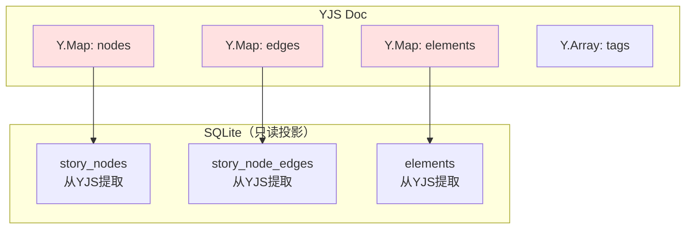
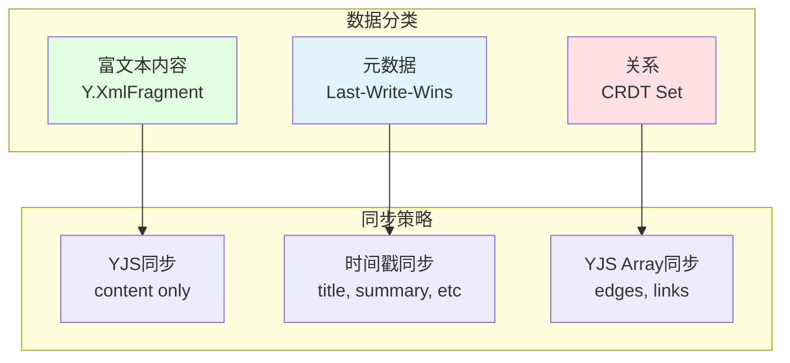
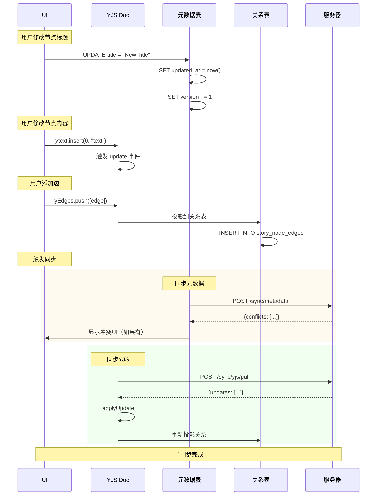

# YJS 实体和关系同步策略

## 核心问题

```typescript
// 你的数据结构
interface StoryNode {
  // ❓ 这些元数据字段如何同步？
  id: string;
  title: string;           // ← 短文本，会冲突
  summary: string;         // ← 中等文本，会冲突
  start: number;           // ← 数字，会冲突
  end: number;
  position_x: number;      // ← 位置，会冲突
  position_y: number;
  
  // ✅ 这个用YJS没问题
  content: TiptapJSON;     // ← 富文本，用Y.XmlFragment
}

// ❓ 这些关系如何同步？
interface Relationships {
  nodeEdges: NodeEdge[];           // Node -> Node
  nodeElements: NodeElementLink[]; // Node -> Element
  nodeStorylines: NodeStoryline[]; // Node -> Storyline
  nodeTags: NodeTag[];             // Node -> Tag
}
```

## 方案对比

### 方案1：全部用 YJS（纯CRDT）



**实现代码：**

```typescript
// ========== YJS 数据结构 ==========
const ydoc = new Y.Doc();

// 节点
const yNodes = ydoc.getMap('story_nodes');
const node1 = new Y.Map();
node1.set('id', 'node-123');
node1.set('title', 'Chapter 1');
node1.set('summary', 'The beginning');
node1.set('position_x', 100);
node1.set('position_y', 200);

// 内容用 Y.XmlFragment（富文本）
const content = new Y.XmlFragment();
node1.set('content', content);

yNodes.set('node-123', node1);

// 边（关系）
const yEdges = ydoc.getArray('story_node_edges');
const edge1 = new Y.Map();
edge1.set('id', 'edge-1');
edge1.set('sourceNodeId', 'node-123');
edge1.set('targetNodeId', 'node-456');
edge1.set('label', 'leads to');
yEdges.push([edge1]);

// Node <-> Element 关系
const yNodeElements = ydoc.getArray('node_elements_link');
const link1 = new Y.Map();
link1.set('nodeId', 'node-123');
link1.set('elementId', 'elem-789');
yNodeElements.push([link1]);

// ========== 监听变化，同步到SQLite ==========
yNodes.observe((event) => {
  event.changes.keys.forEach((change, key) => {
    if (change.action === 'add' || change.action === 'update') {
      const yNode = yNodes.get(key);
      syncNodeToSQLite(yNode);
    } else if (change.action === 'delete') {
      deleteNodeFromSQLite(key);
    }
  });
});

async function syncNodeToSQLite(yNode: Y.Map<any>) {
  const node = {
    id: yNode.get('id'),
    title: yNode.get('title'),
    summary: yNode.get('summary'),
    positionX: yNode.get('position_x'),
    positionY: yNode.get('position_y'),
    // content 保持为 YJS，不提取
    updatedAt: new Date().toISOString()
  };
  
  await db.insert(storyNodes).values(node)
    .onConflictDoUpdate({
      target: storyNodes.id,
      set: node
    });
}
```

**优点：**
- ✅ 统一的CRDT，所有字段自动冲突解决
- ✅ 离线编辑完美支持
- ✅ 时间旅行（Time Machine）简单

**缺点：**
- ❌ 查询复杂（需要先从YJS提取）
- ❌ SQL JOIN困难（数据在CRDT里）
- ❌ 性能开销（每次都要observe + 同步）

**适用场景：**
- 纯离线优先应用
- 不需要复杂查询
- 协作编辑为主

---

### 方案2：混合方案（推荐）



**数据分类：**

```typescript
// ========== 类型1：富文本（用YJS） ==========
interface NodeContent {
  nodeId: string;
  content: Y.XmlFragment;  // YJS管理
}

// ========== 类型2：元数据（用时间戳） ==========
interface NodeMetadata {
  id: string;
  title: string;           // Last-Write-Wins
  summary: string;         // Last-Write-Wins
  positionX: number;       // Last-Write-Wins
  positionY: number;       // Last-Write-Wins
  updatedAt: string;       // 用于冲突解决
  updatedBy: string;       // 用于显示谁修改的
}

// ========== 类型3：关系（用YJS Array） ==========
interface Relationships {
  edges: Y.Array<EdgeMap>;
  nodeElements: Y.Array<LinkMap>;
  nodeTags: Y.Array<TagMap>;
}
```

**实现代码：**

```typescript
// ========== YJS 只存内容和关系 ==========
const ydoc = new Y.Doc();

// 1. 富文本内容（必须用YJS）
const yContents = ydoc.getMap('node_contents');
const content1 = new Y.XmlFragment();
yContents.set('node-123', content1);

// 2. 关系（用YJS保证CRDT）
const yEdges = ydoc.getArray('edges');
const edge = new Y.Map();
edge.set('id', 'edge-1');
edge.set('source', 'node-123');
edge.set('target', 'node-456');
yEdges.push([edge]);

// ========== 元数据用传统同步 ==========
interface NodeMetadataSync {
  id: string;
  title: string;
  summary: string;
  positionX: number;
  positionY: number;
  updatedAt: string;  // ISO timestamp
  version: number;     // 乐观锁
}

// 客户端推送元数据
async function pushMetadata(node: NodeMetadataSync) {
  const response = await api.post('/sync/metadata', {
    table: 'story_nodes',
    data: node
  });
  
  if (response.conflict) {
    // 服务器端版本更新，需要合并
    return handleMetadataConflict(node, response.serverData);
  }
}

// 服务器端处理元数据
app.post('/sync/metadata', async (req, res) => {
  const { table, data } = req.body;
  
  // 读取服务器端版本
  const serverNode = await db.query.storyNodes.findFirst({
    where: eq(storyNodes.id, data.id)
  });
  
  if (!serverNode) {
    // 新节点，直接插入
    await db.insert(storyNodes).values(data);
    return { success: true };
  }
  
  // 时间戳比较（Last-Write-Wins）
  if (new Date(data.updatedAt) > new Date(serverNode.updatedAt)) {
    // 客户端更新
    await db.update(storyNodes)
      .set(data)
      .where(eq(storyNodes.id, data.id));
    return { success: true };
  } else {
    // 服务器端更新
    return { conflict: true, serverData: serverNode };
  }
});
```

**冲突解决：**

```typescript
function handleMetadataConflict(
  localData: NodeMetadataSync,
  serverData: NodeMetadataSync
): NodeMetadataSync {
  // 策略1：Last-Write-Wins
  if (new Date(localData.updatedAt) > new Date(serverData.updatedAt)) {
    return localData;
  }
  return serverData;
  
  // 策略2：字段级合并
  // return {
  //   id: localData.id,
  //   title: newest(localData.title, serverData.title),
  //   summary: newest(localData.summary, serverData.summary),
  //   positionX: localData.positionX, // 总是用本地（协作编辑位置不冲突）
  //   positionY: localData.positionY,
  //   updatedAt: max(localData.updatedAt, serverData.updatedAt)
  // };
}
```

**优点：**
- ✅ 性能好（元数据查询快）
- ✅ SQL查询方便
- ✅ 富文本CRDT保证
- ✅ 实现简单

**缺点：**
- ⚠️ 元数据冲突需要手动处理
- ⚠️ 两套同步逻辑

**适用场景：**
- 大多数创作工具（推荐！）
- 需要复杂查询
- 协作主要在内容，元数据很少冲突

---

### 方案3：YJS + 操作日志（CRDT-like）

```typescript
// ========== 元数据也用操作日志 ==========
interface MetadataOperation {
  id: string;
  op: 'set' | 'update' | 'delete';
  field: string;
  value: any;
  timestamp: string;
  clientId: string;
  vectorClock: Record<string, number>;
}

// 例子：更新title
const op: MetadataOperation = {
  id: 'node-123',
  op: 'update',
  field: 'title',
  value: 'New Title',
  timestamp: '2026-01-11T10:00:00Z',
  clientId: 'client-A',
  vectorClock: { 'client-A': 5, 'client-B': 3 }
};

// 服务器端应用操作
function applyMetadataOp(currentState: any, op: MetadataOperation) {
  // 向量时钟比较
  if (isNewerOperation(op, currentState)) {
    currentState[op.field] = op.value;
    currentState.vectorClock = mergeVectorClocks(
      currentState.vectorClock,
      op.vectorClock
    );
  }
}
```

**优点：**
- ✅ 所有数据CRDT
- ✅ 完美的因果一致性

**缺点：**
- ❌ 复杂度高
- ❌ 性能开销大
- ❌ 存储空间大

**适用场景：**
- 极端协作场景
- 需要完整审计日志

---

## 推荐实现：混合方案详细设计

### 数据分层

```typescript
// ========== 第1层：YJS CRDT数据 ==========
interface YjsLayer {
  // 富文本内容
  'node_contents': Y.Map<Y.XmlFragment>;
  'element_contents': Y.Map<Y.XmlFragment>;
  
  // 关系（经常变化，需要CRDT）
  'edges': Y.Array<Y.Map>;
  'node_elements_link': Y.Array<Y.Map>;
  'node_storylines': Y.Array<Y.Map>;
  'node_tags_link': Y.Array<Y.Map>;
}

// ========== 第2层：元数据（时间戳同步） ==========
interface MetadataLayer {
  // 节点元数据
  storyNodes: {
    id: string;
    title: string;
    summary: string;
    positionX: number;
    positionY: number;
    updatedAt: string;  // 冲突解决依据
  }[];
  
  // 元素元数据
  elements: {
    id: string;
    name: string;
    categoryId: string;
    updatedAt: string;
  }[];
}

// ========== 第3层：静态配置（很少变化） ==========
interface ConfigLayer {
  // 项目设置
  projects: {
    id: string;
    name: string;
    author: string;
  }[];
  
  // 分类（很少修改）
  elementCategories: {
    id: string;
    name: string;
    color: string;
  }[];
}
```

### Schema设计

```sql
-- ========== SQLite Schema ==========

-- 第1层：YJS缓存
CREATE TABLE yjs_cache (
    id TEXT PRIMARY KEY,
    project_id TEXT NOT NULL,
    document_type TEXT NOT NULL,
    
    -- 只存这些类型的YJS state
    -- 'node_contents', 'element_contents', 
    -- 'edges', 'links', 'relationships'
    yjs_state BLOB NOT NULL,
    
    last_synced TEXT NOT NULL,
    is_dirty INTEGER DEFAULT 0
);

-- 第2层：元数据（正常表）
CREATE TABLE story_nodes (
    id TEXT PRIMARY KEY,
    project_id TEXT NOT NULL,
    title TEXT NOT NULL,
    summary TEXT DEFAULT '',
    position_x REAL NOT NULL,
    position_y REAL NOT NULL,
    
    -- 同步字段
    updated_at TEXT NOT NULL,
    updated_by TEXT,  -- 客户端ID
    version INTEGER DEFAULT 1,  -- 乐观锁
    
    -- ❌ 不存 content_json（在YJS里）
    
    FOREIGN KEY (project_id) REFERENCES projects(id)
);

-- 第2层：关系表（从YJS Array投影）
CREATE TABLE story_node_edges (
    id TEXT PRIMARY KEY,
    source_node_id TEXT NOT NULL,
    target_node_id TEXT NOT NULL,
    label TEXT DEFAULT '',
    
    -- 这个表是从 YJS edges array 投影出来的
    -- 客户端修改时直接修改YJS，然后这个表自动更新
    
    FOREIGN KEY (source_node_id) REFERENCES story_nodes(id),
    FOREIGN KEY (target_node_id) REFERENCES story_nodes(id)
);

-- 第3层：配置表（很少同步）
CREATE TABLE projects (
    id TEXT PRIMARY KEY,
    user_id TEXT NOT NULL,
    name TEXT NOT NULL,
    author TEXT NOT NULL,
    created_at TEXT NOT NULL,
    updated_at TEXT NOT NULL
);
```

### 同步实现

```typescript
// ========== src/renderer/lib/sync-manager.ts ==========

export class SyncManager {
  private yjsDoc: Y.Doc;
  private projectId: string;
  
  async sync() {
    // 1️⃣ 同步YJS数据（内容+关系）
    await this.syncYjsData();
    
    // 2️⃣ 同步元数据（title, position等）
    await this.syncMetadata();
    
    // 3️⃣ 从YJS投影到SQLite关系表
    await this.projectRelationships();
  }
  
  // ========== YJS同步 ==========
  async syncYjsData() {
    // Pull from server
    const localVector = Y.encodeStateVector(this.yjsDoc);
    const { updates } = await api.post('/sync/yjs/pull', {
      projectId: this.projectId,
      stateVector: Array.from(localVector)
    });
    
    // Apply updates
    updates.forEach(update => {
      Y.applyUpdate(this.yjsDoc, new Uint8Array(update));
    });
    
    // Push local changes
    const dirtyDocs = await db.select()
      .from(yjsCache)
      .where(eq(yjsCache.isDirty, 1));
    
    for (const doc of dirtyDocs) {
      await api.post('/sync/yjs/push', {
        projectId: this.projectId,
        documentType: doc.documentType,
        update: Array.from(doc.yjsState)
      });
    }
  }
  
  // ========== 元数据同步 ==========
  async syncMetadata() {
    // Pull metadata changes
    const lastSync = await this.getLastMetadataSync();
    const { nodes, elements } = await api.get('/sync/metadata/pull', {
      params: {
        projectId: this.projectId,
        since: lastSync
      }
    });
    
    // Apply to local database
    for (const node of nodes) {
      const local = await db.query.storyNodes.findFirst({
        where: eq(storyNodes.id, node.id)
      });
      
      if (!local || new Date(node.updatedAt) > new Date(local.updatedAt)) {
        // Server is newer
        await db.insert(storyNodes).values(node)
          .onConflictDoUpdate({
            target: storyNodes.id,
            set: node
          });
      }
    }
    
    // Push local changes
    const localChanges = await db.select()
      .from(storyNodes)
      .where(gt(storyNodes.updatedAt, lastSync));
    
    await api.post('/sync/metadata/push', {
      projectId: this.projectId,
      nodes: localChanges
    });
  }
  
  // ========== 从YJS投影关系 ==========
  async projectRelationships() {
    // 从 YJS edges array 提取到 SQLite
    const yEdges = this.yjsDoc.getArray('edges');
    
    // 清空旧数据
    await db.delete(storyNodeEdges)
      .where(eq(storyNodeEdges.projectId, this.projectId));
    
    // 插入新数据
    const edges = [];
    yEdges.forEach(yEdge => {
      if (yEdge instanceof Y.Map) {
        edges.push({
          id: yEdge.get('id'),
          sourceNodeId: yEdge.get('source'),
          targetNodeId: yEdge.get('target'),
          label: yEdge.get('label') || ''
        });
      }
    });
    
    if (edges.length > 0) {
      await db.insert(storyNodeEdges).values(edges);
    }
  }
}
```

### 冲突处理UI

```typescript
// ========== src/renderer/components/ConflictResolver.tsx ==========

interface MetadataConflict {
  field: string;
  localValue: any;
  serverValue: any;
  localTime: string;
  serverTime: string;
}

export function ConflictResolver({ conflicts }: { conflicts: MetadataConflict[] }) {
  return (
    <div className="conflict-modal">
      <h2>检测到数据冲突</h2>
      <p>以下字段在其他设备上被修改：</p>
      
      {conflicts.map(conflict => (
        <div key={conflict.field} className="conflict-item">
          <h3>{conflict.field}</h3>
          
          <div className="conflict-options">
            <button onClick={() => chooseLocal(conflict)}>
              <div>保留本地</div>
              <div>{conflict.localValue}</div>
              <div className="timestamp">{conflict.localTime}</div>
            </button>
            
            <button onClick={() => chooseServer(conflict)}>
              <div>使用服务器</div>
              <div>{conflict.serverValue}</div>
              <div className="timestamp">{conflict.serverTime}</div>
            </button>
          </div>
        </div>
      ))}
    </div>
  );
}
```

## 数据流时序图



## 最终建议

### ✅ 推荐：混合方案

```typescript
// 内容：YJS（必须CRDT）
node_contents: Y.XmlFragment

// 关系：YJS Array（需要CRDT）
edges: Y.Array<Y.Map>
node_elements: Y.Array<Y.Map>

// 元数据：时间戳（冲突少）
title: string + updatedAt
summary: string + updatedAt
position: number + updatedAt
```

### 实现优先级

```
P0: YJS内容同步
    - node_contents
    - element_contents

P1: 元数据同步
    - title, summary
    - Last-Write-Wins

P2: 关系同步
    - edges用YJS Array
    - 投影到SQLite表

P3: 冲突UI
    - 元数据冲突提示
    - 用户选择保留哪个
```

### 性能优化

```typescript
// 批量同步，减少请求
const batchSync = async () => {
  const [yjsResult, metadataResult] = await Promise.all([
    syncYjsData(),
    syncMetadata()
  ]);
};

// 增量同步，只传变化
const incrementalSync = async () => {
  const changes = await getChangesSince(lastSyncTime);
  await api.post('/sync/incremental', { changes });
};
```
