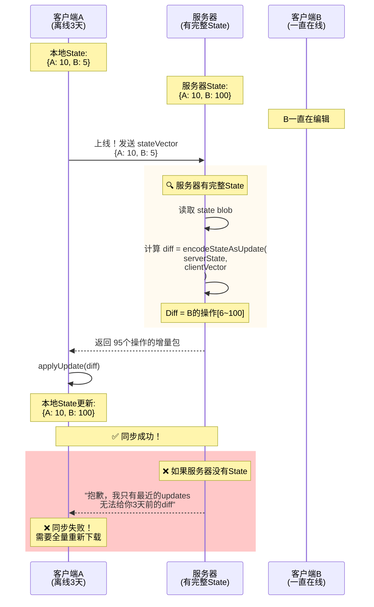
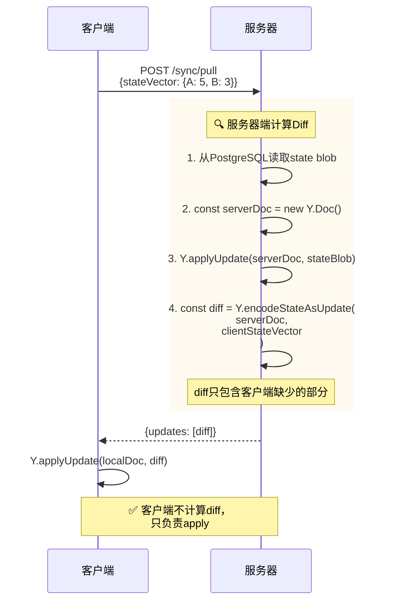
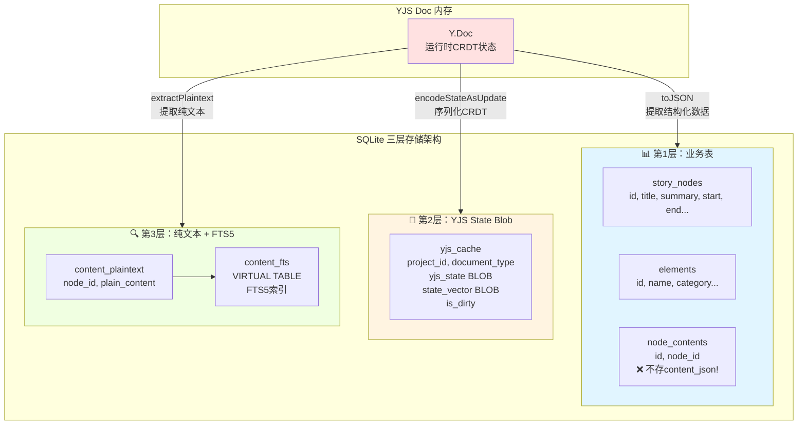
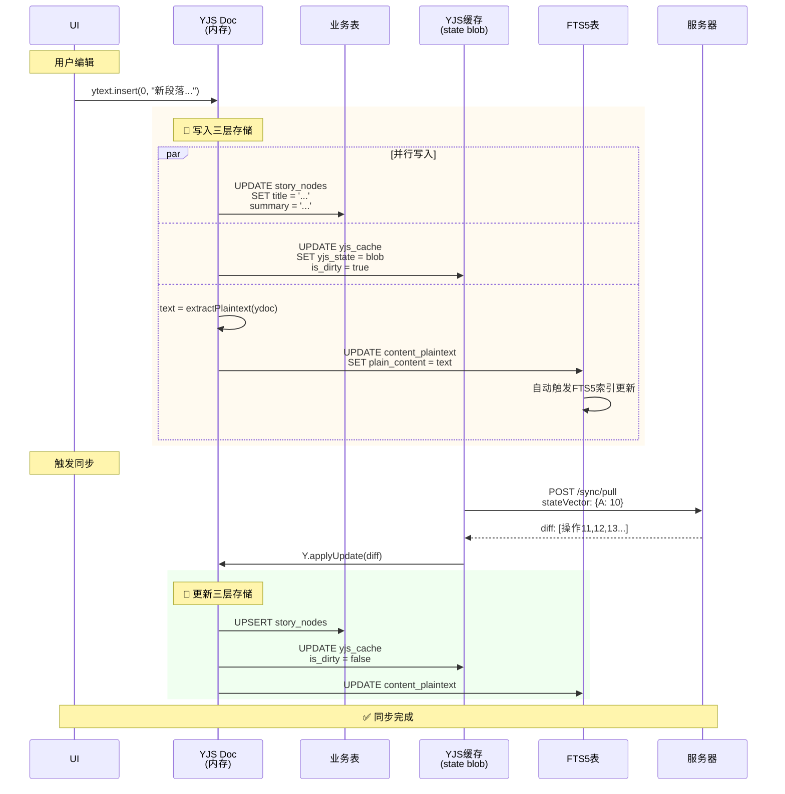
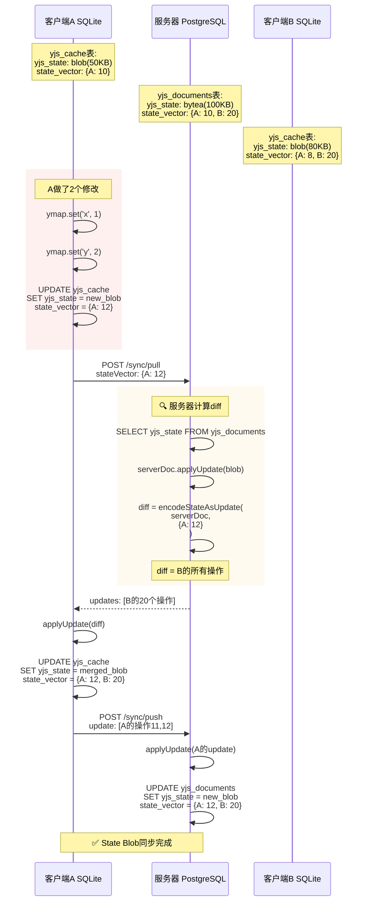

# YJS 存储架构详解

## 核心问题回答

### ✅ 1. State Blob 必须存在哪里？

**答案：客户端和服务器都必须存！**

```
客户端 SQLite: ✅ 必须存 state blob
服务器 PostgreSQL: ✅ 必须存 state blob
```

**原因时序图：**



### ✅ 2. Diff 在哪里计算？

**答案：在服务器端计算！**



### ✅ 3. 本地SQLite应该存什么？

**答案：三层存储！**



## 完整数据流时序图

### 场景1：用户编辑并同步



### 场景2：State Blob 完整同步流程



## SQL Schema 定义

### 客户端 SQLite

```sql
-- ========== 第1层：业务表 ==========
CREATE TABLE story_nodes (
    id TEXT PRIMARY KEY,
    project_id TEXT NOT NULL,
    title TEXT NOT NULL,
    summary TEXT DEFAULT '',
    start INTEGER NOT NULL,
    end INTEGER NOT NULL DEFAULT 0,
    story_stage_id TEXT,
    position_x REAL NOT NULL,
    position_y REAL NOT NULL,
    created_at TEXT NOT NULL,
    updated_at TEXT NOT NULL,
    FOREIGN KEY (project_id) REFERENCES projects(id) ON DELETE CASCADE
);

CREATE TABLE node_contents (
    id TEXT PRIMARY KEY,
    node_id TEXT NOT NULL,
    project_id TEXT NOT NULL,
    -- ❌ 不存 content_json TEXT
    -- ❌ 不存 outline_json TEXT
    -- 这些都在 yjs_state blob 里！
    created_at TEXT NOT NULL,
    updated_at TEXT NOT NULL,
    FOREIGN KEY (node_id) REFERENCES story_nodes(id) ON DELETE CASCADE
);

-- ========== 第2层：YJS State Blob ==========
CREATE TABLE yjs_cache (
    id TEXT PRIMARY KEY,  -- 例如: 'proj-123:nodes'
    project_id TEXT NOT NULL,
    document_type TEXT NOT NULL,  -- 'nodes', 'elements', 'content'
    
    -- 完整的YJS CRDT状态
    yjs_state BLOB NOT NULL,
    
    -- 状态向量（可选，用于快速判断是否需要同步）
    state_vector BLOB,
    
    -- 同步元数据
    last_synced TEXT NOT NULL,
    is_dirty INTEGER DEFAULT 0,  -- 1 = 有未同步的本地修改
    
    UNIQUE(project_id, document_type)
);

CREATE INDEX idx_yjs_cache_dirty ON yjs_cache(is_dirty) WHERE is_dirty = 1;

-- ========== 第3层：纯文本 + FTS5 ==========
CREATE TABLE content_plaintext (
    id TEXT PRIMARY KEY,
    node_id TEXT NOT NULL,
    project_id TEXT NOT NULL,
    
    -- 从 yjs_state 中提取的纯文本
    plain_content TEXT,
    
    updated_at TEXT NOT NULL,
    FOREIGN KEY (node_id) REFERENCES story_nodes(id) ON DELETE CASCADE
);

-- FTS5 全文搜索虚拟表
CREATE VIRTUAL TABLE content_fts USING fts5(
    content,
    tokenize = 'unicode61',  -- 或用 'simple' / 自定义tokenizer
    content = 'content_plaintext',
    content_rowid = 'rowid'
);

-- 自动同步触发器
CREATE TRIGGER content_plaintext_ai AFTER INSERT ON content_plaintext BEGIN
    INSERT INTO content_fts(rowid, content) 
    VALUES (new.rowid, new.plain_content);
END;

CREATE TRIGGER content_plaintext_au AFTER UPDATE ON content_plaintext BEGIN
    UPDATE content_fts 
    SET content = new.plain_content 
    WHERE rowid = new.rowid;
END;

CREATE TRIGGER content_plaintext_ad AFTER DELETE ON content_plaintext BEGIN
    DELETE FROM content_fts WHERE rowid = old.rowid;
END;
```

### 服务器 PostgreSQL

```sql
-- 用户和项目
CREATE TABLE users (
    id UUID PRIMARY KEY DEFAULT gen_random_uuid(),
    email TEXT NOT NULL UNIQUE,
    name TEXT,
    created_at TIMESTAMP NOT NULL DEFAULT NOW(),
    updated_at TIMESTAMP NOT NULL DEFAULT NOW()
);

CREATE TABLE projects (
    id UUID PRIMARY KEY,
    user_id UUID NOT NULL REFERENCES users(id) ON DELETE CASCADE,
    name TEXT NOT NULL,
    author TEXT NOT NULL,
    description_json JSONB DEFAULT '{}',
    created_at TIMESTAMP NOT NULL,
    updated_at TIMESTAMP NOT NULL
);

-- YJS 文档存储（核心表）
CREATE TABLE yjs_documents (
    id UUID PRIMARY KEY DEFAULT gen_random_uuid(),
    project_id UUID NOT NULL REFERENCES projects(id) ON DELETE CASCADE,
    document_type TEXT NOT NULL,  -- 'nodes', 'elements', 'content'
    
    -- 完整的YJS CRDT状态（二进制）
    yjs_state BYTEA NOT NULL,
    
    -- 状态向量
    state_vector BYTEA,
    
    -- 元数据
    last_modified TIMESTAMP NOT NULL DEFAULT NOW(),
    
    UNIQUE(project_id, document_type)
);

CREATE INDEX idx_yjs_documents_project ON yjs_documents(project_id);
CREATE INDEX idx_yjs_documents_modified ON yjs_documents(last_modified);

-- YJS 增量更新日志（可选，用于审计和Time Machine）
CREATE TABLE yjs_updates (
    id UUID PRIMARY KEY DEFAULT gen_random_uuid(),
    document_id UUID NOT NULL REFERENCES yjs_documents(id) ON DELETE CASCADE,
    client_id TEXT NOT NULL,
    
    -- 增量更新数据
    update BYTEA NOT NULL,
    
    -- 序列号
    sequence_num BIGINT NOT NULL,
    
    created_at TIMESTAMP NOT NULL DEFAULT NOW()
);

CREATE INDEX idx_yjs_updates_document ON yjs_updates(document_id, sequence_num);
```

## 代码示例

### 客户端：写入三层存储

```typescript
// src/renderer/lib/yjs-storage.ts
import * as Y from 'yjs';
import { db } from './db';
import { storyNodes, yjsCache, contentPlaintext } from '../schema/drizzle';

export class YJSStorage {
  private ydoc: Y.Doc;
  private projectId: string;
  
  constructor(projectId: string) {
    this.projectId = projectId;
    this.ydoc = new Y.Doc();
    
    // 监听YJS变化
    this.ydoc.on('update', this.onUpdate.bind(this));
  }
  
  async onUpdate(update: Uint8Array, origin: any) {
    // 1️⃣ 更新业务表
    await this.syncToBusinessTables();
    
    // 2️⃣ 更新YJS缓存
    await this.updateYjsCache();
    
    // 3️⃣ 更新FTS5
    await this.updateFullTextSearch();
  }
  
  // 第1层：同步到业务表
  async syncToBusinessTables() {
    const ymap = this.ydoc.getMap('story_nodes');
    
    for (const [id, ynode] of ymap.entries()) {
      if (ynode instanceof Y.Map) {
        const node = {
          id: ynode.get('id'),
          projectId: this.projectId,
          title: ynode.get('title'),
          summary: ynode.get('summary'),
          start: ynode.get('start'),
          end: ynode.get('end'),
          // ... 其他字段
          updatedAt: new Date().toISOString()
        };
        
        await db.insert(storyNodes).values(node)
          .onConflictDoUpdate({
            target: storyNodes.id,
            set: node
          });
      }
    }
  }
  
  // 第2层：更新YJS state blob
  async updateYjsCache() {
    const state = Y.encodeStateAsUpdate(this.ydoc);
    const stateVector = Y.encodeStateVector(this.ydoc);
    
    await db.insert(yjsCache).values({
      id: `${this.projectId}:nodes`,
      projectId: this.projectId,
      documentType: 'nodes',
      yjsState: Buffer.from(state),
      stateVector: Buffer.from(stateVector),
      lastSynced: new Date().toISOString(),
      isDirty: 1  // 标记为需要同步
    }).onConflictDoUpdate({
      target: yjsCache.id,
      set: {
        yjsState: Buffer.from(state),
        stateVector: Buffer.from(stateVector),
        isDirty: 1
      }
    });
  }
  
  // 第3层：提取纯文本，更新FTS5
  async updateFullTextSearch() {
    const ymap = this.ydoc.getMap('node_contents');
    
    for (const [nodeId, ycontent] of ymap.entries()) {
      if (ycontent instanceof Y.XmlFragment || ycontent instanceof Y.Text) {
        // 提取纯文本
        const plaintext = this.extractPlaintext(ycontent);
        
        await db.insert(contentPlaintext).values({
          id: `content-${nodeId}`,
          nodeId,
          projectId: this.projectId,
          plainContent: plaintext,
          updatedAt: new Date().toISOString()
        }).onConflictDoUpdate({
          target: contentPlaintext.id,
          set: {
            plainContent: plaintext,
            updatedAt: new Date().toISOString()
          }
        });
        
        // FTS5会通过触发器自动更新
      }
    }
  }
  
  // 提取纯文本（从YJS富文本）
  private extractPlaintext(ytext: Y.Text | Y.XmlFragment): string {
    if (ytext instanceof Y.Text) {
      return ytext.toString();
    }
    
    // 如果是XmlFragment（例如Tiptap）
    // 递归提取所有文本节点
    // TODO: 实现具体逻辑
    return '';
  }
  
  // 全文搜索
  async search(query: string) {
    // 使用FTS5搜索
    const results = await db.execute(sql`
      SELECT node_id 
      FROM content_fts 
      WHERE content MATCH ${query}
      ORDER BY rank
      LIMIT 20
    `);
    
    // 再查询完整的业务数据
    const nodeIds = results.map(r => r.node_id);
    return db.select()
      .from(storyNodes)
      .where(inArray(storyNodes.id, nodeIds));
  }
}
```

### 服务器：计算Diff

```typescript
// server/src/routes/sync.ts
import { FastifyInstance } from 'fastify';
import * as Y from 'yjs';
import { db } from '../db';
import { yjsDocuments } from '../schema';

export async function syncRoutes(fastify: FastifyInstance) {
  // Pull：客户端拉取服务器的更新
  fastify.post('/sync/pull', async (req, res) => {
    const { projectId, documentType, stateVector } = req.body;
    
    // 1️⃣ 从PostgreSQL读取服务器的state blob
    const doc = await db.query.yjsDocuments.findFirst({
      where: (docs, { and, eq }) => and(
        eq(docs.projectId, projectId),
        eq(docs.documentType, documentType)
      )
    });
    
    if (!doc) {
      return res.status(404).send({ error: 'Document not found' });
    }
    
    // 2️⃣ 加载到Y.Doc
    const serverDoc = new Y.Doc();
    Y.applyUpdate(serverDoc, doc.yjsState);
    
    // 3️⃣ 计算diff（这是关键！）
    const clientVector = new Uint8Array(stateVector);
    const diff = Y.encodeStateAsUpdate(serverDoc, clientVector);
    
    return {
      updates: [Array.from(diff)],
      serverVector: Array.from(Y.encodeStateVector(serverDoc))
    };
  });
  
  // Push：客户端推送更新到服务器
  fastify.post('/sync/push', async (req, res) => {
    const { projectId, documentType, update } = req.body;
    
    // 1️⃣ 读取当前服务器state
    const doc = await db.query.yjsDocuments.findFirst({
      where: (docs, { and, eq }) => and(
        eq(docs.projectId, projectId),
        eq(docs.documentType, documentType)
      )
    });
    
    const serverDoc = new Y.Doc();
    if (doc) {
      Y.applyUpdate(serverDoc, doc.yjsState);
    }
    
    // 2️⃣ 应用客户端的更新
    const clientUpdate = new Uint8Array(update);
    Y.applyUpdate(serverDoc, clientUpdate);
    
    // 3️⃣ 保存新的state
    const newState = Y.encodeStateAsUpdate(serverDoc);
    const newVector = Y.encodeStateVector(serverDoc);
    
    await db.insert(yjsDocuments).values({
      projectId,
      documentType,
      yjsState: Buffer.from(newState),
      stateVector: Buffer.from(newVector),
      lastModified: new Date()
    }).onConflictDoUpdate({
      target: [yjsDocuments.projectId, yjsDocuments.documentType],
      set: {
        yjsState: Buffer.from(newState),
        stateVector: Buffer.from(newVector),
        lastModified: new Date()
      }
    });
    
    return { success: true };
  });
}
```

## 总结

### ✅ 你的理解完全正确！

| 问题 | 答案 |
|------|------|
| 本地需要存state blob? | ✅ 是的，存在 yjs_cache 表 |
| 服务器需要存state blob? | ✅ 是的，存在 yjs_documents 表 |
| 服务器没有state能同步吗? | ❌ 不能，客户端无法获取完整diff |
| diff在哪里计算? | ✅ 在服务器端 |
| 本地需要业务表? | ✅ 是的，用于快速查询 |
| 本地需要content json? | ❌ 不需要，改用 plaintext + FTS5 |
| 需要FTS5虚拟表? | ✅ 是的，用于全文搜索 |

### 📊 三层存储总结

```
Layer 1: 业务表         → 快速查询、UI展示
Layer 2: YJS state blob → 离线同步、CRDT合并
Layer 3: 纯文本 + FTS5  → 全文搜索
```

三层缺一不可！
